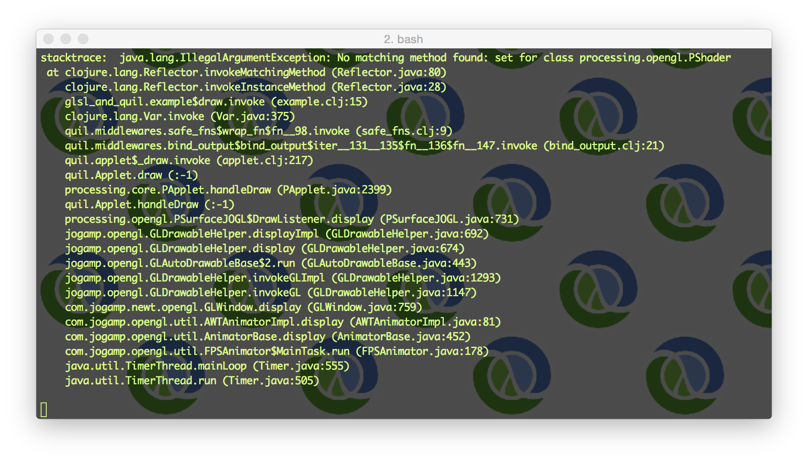

## Purpose

This is a small demonstration of how to run GLSL shaders in a quil sketch.

## Usage

This project requires Leiningen; you can find instructions on how to install it here: http://www.leiningen.org/

Once you have that installed, just clone this repository...

    git clone https://github.com/quephird/glsl-and-quil

... change into the new directory and fire up the REPL...

    lein repl

Once it is running, load the example sketch like so,

    (load-file "./src/glsl_and_quil/example.clj")

... and you should see something like this:

## Caveats

#### Uniforms

Make sure to explicitly cast numbers that will passed from Clojure into GLSL uniforms as floats. If you do not, you will likely encounter an error such as this:

#### Location of shader files

By default, quil sketches (actually, Leiningen projects in general) will find shader files in the resources subdirectory in your project. You can override the default by setting the `:resource-paths` property in your project.clj file; look [here](https://github.com/technomancy/leiningen/blob/master/sample.project.clj) for an example.

## Useful links

quil  
https://github.com/quil/quil  

Processing  
http://www.processing.org/

The Book of Shaders  
http://thebookofshaders.com/

## License

Copyright © 2016 ⅅ₳ℕⅈⅇℒℒⅇ Ҝⅇℱℱoℜⅆ

Distributed under the Eclipse Public License either version 1.0 or (at your option) any later version.
