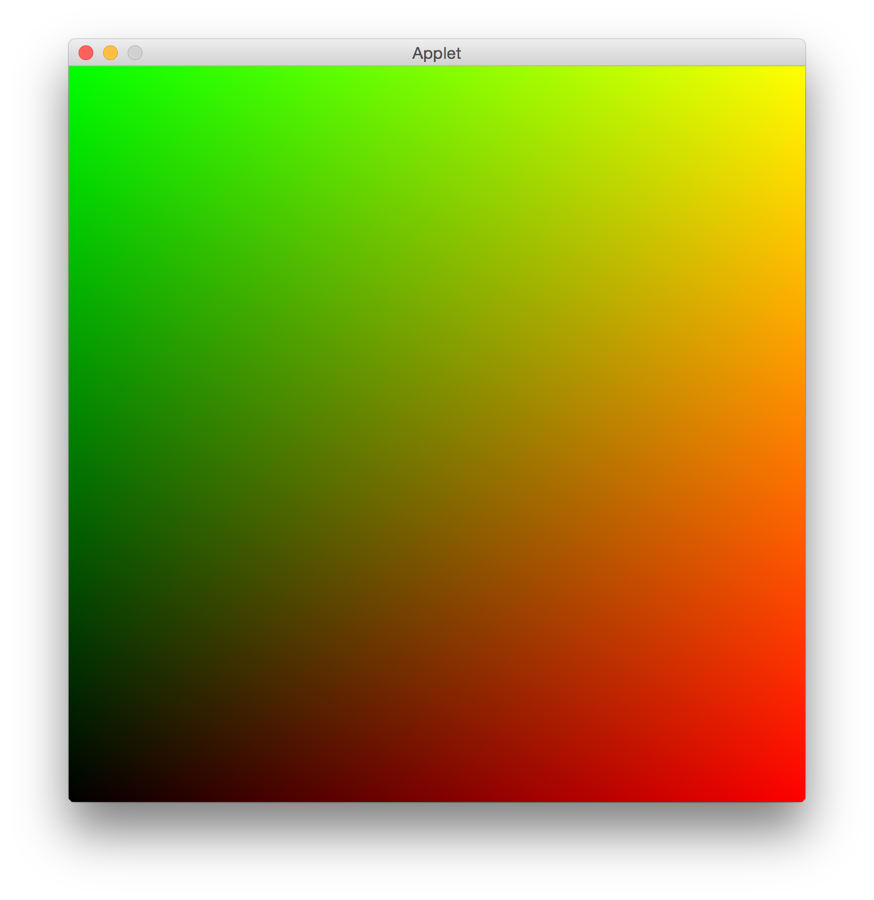

## Purpose

This is a small demonstration of how to run GLSL shaders in a quil sketch.

## Usage

This project requires Leiningen; you can find instructions on how to install it here: http://www.leiningen.org/

Once you have that installed, just clone this repository...

    git clone https://github.com/quephird/glsl-and-quil

... change into the new directory and fire up the REPL...

    lein repl

Once it is running, load the example sketch like so,

    (load-file "./src/glsl_and_quil/example.clj")

... and you should see something like this:

## Caveats

floats

resource directory for shaders

## Useful links

quil  
https://github.com/quil/quil  

Processing  
http://www.processing.org/

The Book of Shaders  
http://thebookofshaders.com/

## License

Copyright © 2016 ⅅ₳ℕⅈⅇℒℒⅇ Ҝⅇℱℱoℜⅆ

Distributed under the Eclipse Public License either version 1.0 or (at your option) any later version.
